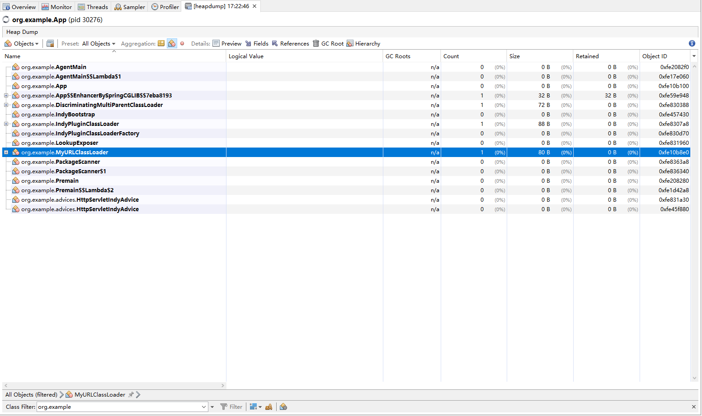

### Context
Sometimes, a Java agent may need to have the ability to detach or hot-update.

### Description of the problem
In this example, the `WithCustomMapping#bootstrap` API is used for instrumentation, but once the target class is enhanced and the bootstrap method is executed, 
the class loader for the agent cannot be unloaded. There are several known scenarios:

1. If `inline=true` is used without using the `WithCustomMapping#bootstrap` API, unloading can be performed normally.
2. If the `WithCustomMapping#bootstrap` API is used(`-Dagent.indy.enabled=true`) but the target method is not called, i.e., the custom bootstrap method is not executed, unloading can be completed normally.
3. If the `WithCustomMapping#bootstrap` API is used(`-Dagent.indy.enabled=true`) and the target method is called, i.e., the custom bootstrap method is executed, unloading cannot be completed normally.

The custom bootstrap method in this example mainly involves two classes: `IndyBootstrapDispatcher` and `IndyBootstrap`. 
They are copied from the elastic-apm-agent and simplified. This implementation uses a class loader named `IndyPluginClassLoader`, which inherits from `ByteArrayClassLoader`, to load the custom advice class.

### Reproducer
1. build the project
```shell
mvn clean package
```
2. To run this example using Java 8 (replace the `${JAVA_8_HOME}` and `${BUILD_PATH}`)
```shell
${JAVA_8_HOME}/bin/java \
-javaagent:${BUILD_PATH}/agent/target/agent-1.0-SNAPSHOT.jar \ 
-Dagent.detach.file=${BUILD_PATH}/detach.txt \
-Dagent.file=${BUILD_PATH}/agent-core/target/agent-core-1.0-SNAPSHOT.jar \ 
-Dagent.indy.enabled=true \
-XX:+TraceClassUnloading \
-XX:+ExplicitGCInvokesConcurrentAndUnloadsClasses \ 
-Xms32M \
-Xmx32M \
-jar ${BUILD_PATH}/app/target/app-1.0-SNAPSHOT.jar
```
3. Ensure that the custom bootstrap method is executed.
```shell
curl http://127.0.0.1:8080/
```
4. Detach the javaagent(rename the `detach2.txt` to `detach.txt`)
```shell
mv detach2.txt detach.txt
```

### Others
1. jvisualvm(The retained size of `org.example.MyURLClassLoader` is 0)

2. the heap-dump file
${project.base.dir}/heapdump-by-VisualVM.hprof